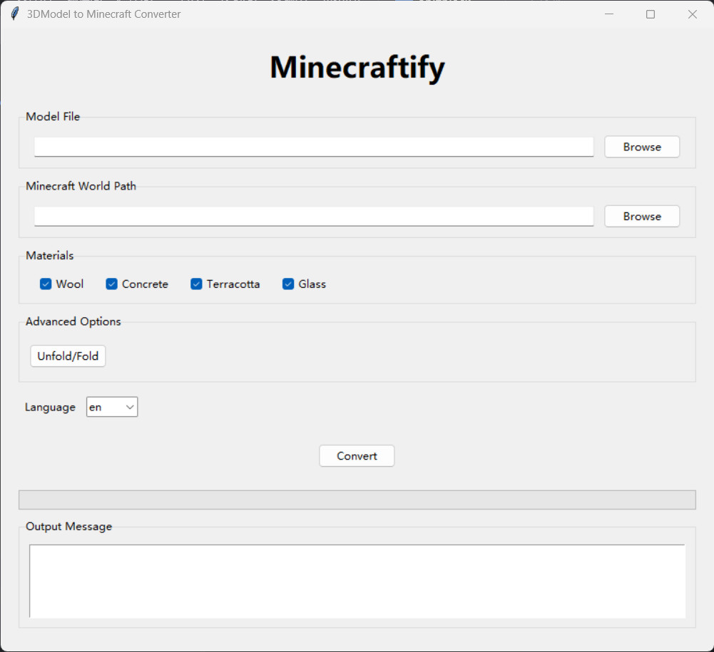

# Minecraftify
A tool for converting 3D models to Minecraft blocks. [中文](README_zh.md)


## Project Introduction
This project is a tool for voxelizing 3D models and converting them into blocks in the Minecraft world. It supports multiple 3D model formats, such as OBJ, STL, PLY, etc., and can perform conversions based on the materials (wool, concrete, terracotta, glass) selected by the user.

## Installation
### For Users
1. Download the latest release from the releases page
2. Extract the downloaded compressed package
3. Run `Minecraftify.exe` to start the application

### For Developers
1. Clone this repository
2. Install the required dependencies:
   ```bash
   pip install -r requirements.txt
   ```
3. Run `gui.py` to start the application

## Usage Instructions
1. Prepare the 3D model file you want to convert. Supported formats include OBJ, STL, PLY, GLB, etc.
2. Create a new world in Minecraft, save and exit. It is recommended to choose a flat world.
3. Run `Minecraftify.exe` or `gui.py` to start the tool interface.

4. In the interface, select the 3D model file you want to convert and the path of an existing Minecraft world (usually `Game Directory\saves\World Name\`).
5. Check the materials to be used for the conversion. Currently, wool, concrete, terracotta, and glass are supported.
6. You can expand the advanced options to set the starting position, voxel size, game version, etc.
7. Click the "Convert" button to start the conversion.
8. After the conversion is completed, open the selected world in Minecraft, and you can see the converted model.


## Notes
- Please ensure that the selected Minecraft world path is correct to avoid data loss.
- Setting a smaller voxel size can improve the conversion accuracy, but it will also increase the conversion time.
- The conversion process may take some time, depending on the complexity of the model.
- Currently, only solid - color conversions are supported. Texture mapping will be forcibly converted to a single color.
- The conversion effect has only been tested in Java Edition 1.20.1. Other versions need to be verified.

## File Description
- `gui.py`: The graphical user interface of the tool.
- `tran.py`: The core code for implementing the 3D model conversion logic.
