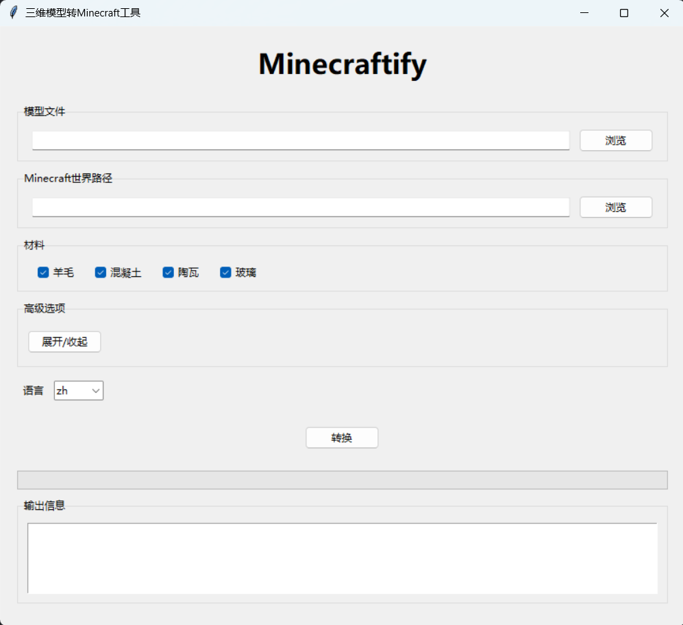
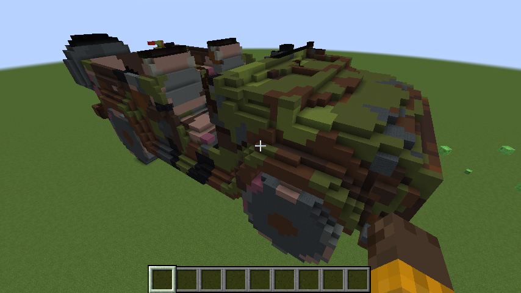

<p align="center">
  
</p>

# Minecraftify
三维模型转Minecraft工具 [English](README.md)

## 项目介绍
本项目是一个用于将3D模型进行体素化并转换为Minecraft世界中的方块的工具。支持多种3D模型格式，如OBJ、STL、PLY等，并可根据用户选择的材料（羊毛、混凝土、陶瓦、玻璃）进行转换。

## 安装说明
### 发布版
1. 从发布页面下载最新的release版本
2. 解压下载的压缩文件
3. 运行`Minecraftify.exe`即可启动程序

### 开发者
1. 克隆本仓库
2. 安装所需依赖：
   ```bash
   pip install -r requirements.txt
   ```
3. 运行`gui.py`启动程序

## 使用方法
1. 准备好要转换的3D模型文件，支持的格式包括OBJ、STL、PLY、GLB等。
2. 在Minecraft中创建一个新的世界，保存并退出，最好选择一个平坦的世界。
3. 运行`Minecraftify.exe`或`gui.py`启动工具界面。

4. 在界面中选择要转换的3D模型文件和已有的Minecraft世界路径(一般为`游戏目录\saves\世界名称\`)。
5. 勾选转换使用的材料，目前支持羊毛、混凝土、陶瓦、玻璃。
6. 可以展开高级选项，设置起始位置、旋转角度、体素大小和游戏版本等。
7. 点击"转换"按钮开始转换。
8. 转换完成后，在Minecraft中打开已选择的世界，即可看到转换后的模型。


## 注意事项
- 请确保选择的Minecraft世界路径正确，避免数据丢失。
- 旋转角度为度数，使用三个角度表示模型在x、y、z轴上的旋转。
- 设置较小的体素大小可以提高转换精度，但也会增加转换时间。
- 转换过程可能需要一定时间，具体取决于模型的复杂度。
- 目前仅支持纯色的转换，纹理映射将被强制转换为单一颜色。
- 目前仅测试了在Java Edition 1.20.1版本下的转换效果，其他版本有待验证。

## 文件说明
- `gui.py`：工具的图形用户界面。
- `tran.py`：实现3D模型转换逻辑的核心代码。
